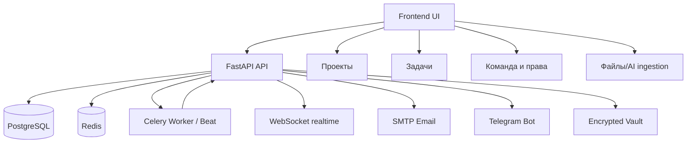

# PlannerBro — Портал документации

Этот раздел — единая точка входа в актуальную документацию PlannerBro.

## Карта документов

- [12_Функционал системы](./12_Функционал_системы.md)
- [13_Справка пользователя](./13_Справка_пользователя.md)
- [15_Права, роли и назначения](./15_Права_роли_и_назначения.md)

## Что читать в зависимости от роли

- Исполнитель: `13_Справка пользователя` + раздел «Мои задачи».
- Начальник отдела / менеджер: `12_Функционал системы` + `15_Права, роли и назначения`.
- ГИП / заместитель: `15_Права, роли и назначения` (блок «глобальные назначения»).
- Администратор: все документы.

## Схема модулей

