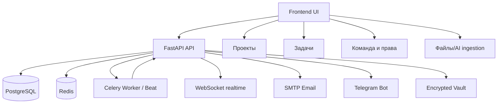

# PlannerBro — Портал документации

Этот раздел — единая точка входа в актуальную документацию PlannerBro.

## Читать в таком порядке

Если нужно быстро войти в проект без лишней археологии, идите так:

1. [01_План реализации и TODO](./01_План_реализации_и_TODO.md)
2. [02_Текущее состояние проекта](./02_Текущее_состояние_проекта.md)
3. [03_Архитектурная память проекта](./03_Архитектурная_память_проекта.md)
4. [06_Source of Truth](./06_Source_of_Truth.md)
5. [20_Доменные контракты](./20_Доменные_контракты.md)
6. [07_Code Map](./07_Code_Map.md)
7. [08_Проверки и верификация](./08_Проверки_и_верификация.md)
8. [04_Workflow документации и синхронизации](./04_Workflow_документации_и_синхронизации.md)
9. [05_Multi-Mac workflow](./05_Multi-Mac_workflow.md)

## Карта документов

- [01_План реализации и TODO](./01_План_реализации_и_TODO.md)
- [02_Текущее состояние проекта](./02_Текущее_состояние_проекта.md)
- [03_Архитектурная память проекта](./03_Архитектурная_память_проекта.md)
- [04_Workflow документации и синхронизации](./04_Workflow_документации_и_синхронизации.md)
- [05_Multi-Mac workflow](./05_Multi-Mac_workflow.md)
- [06_Source of Truth](./06_Source_of_Truth.md)
- [20_Доменные контракты](./20_Доменные_контракты.md)
- [07_Code Map](./07_Code_Map.md)
- [08_Проверки и верификация](./08_Проверки_и_верификация.md)
- [12_Функционал системы](./12_Функционал_системы.md)
- [13_Справка пользователя](./13_Справка_пользователя.md)
- [15_Права, роли и назначения](./15_Права_роли_и_назначения.md)
- [16_Шпаргалка доступа к серверу с Mac](./16_Шпаргалка_доступ_к_серверу_с_Mac.md)
- [17_Пентест-режим отчет 2026-03-11](./17_Пентест_режим_отчет_2026-03-11.md)
- [18_Чеклист нового продового сервера](./18_Чеклист_нового_продового_сервера.md)
- [19_Аудит расхождений локального репо и нового прода](./19_Аудит_расхождений_локального_репо_и_нового_прода_2026-03-12.md)
- [21_Git ветки и порядок](./21_Git_ветки_и_порядок.md)

## Что читать в зависимости от роли

- Оператор / владелец проекта: `01` + `02` + `04` + `05`.
- LLM-coder / новый инженер: `01` + `02` + `03` + `04`.
- Исполнитель: `13_Справка пользователя` + раздел «Мои задачи».
- Начальник отдела / менеджер: `12_Функционал системы` + `15_Права, роли и назначения`.
- ГИП / заместитель: `15_Права, роли и назначения` (блок «глобальные назначения»).
- Администратор: все документы.

## Схема модулей

