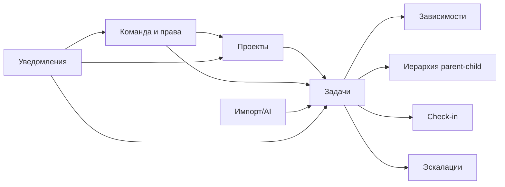

# PlannerBro — Функционал системы

## 1. Проекты

### Режимы проекта

- `flexible` — гибкий режим.
- `strict` — строгий режим:
  - запрет дат в прошлом (по флагам проекта),
  - дочерняя задача должна быть в диапазоне дат родителя,
  - соблюдение правил зависимостей.

### Что можно делать в проекте

- управлять статусом, приоритетом, сроками, владельцем;
- вести чеклист завершения (Definition of Done);
- прикладывать файлы проекта и запускать AI-обработку;
- управлять составом проекта (owner/manager/member);
- смотреть LIST/Gantt и критический путь.

## 2. Задачи

### Модель управления задачами

- `parent-child` — структура/группировка.
- `dependency` — порядок выполнения.
- эти понятия разделены.

### Типы зависимостей

- `FS` (Finish-to-Start): следующая после окончания предыдущей.
- `SS` (Start-to-Start): синхронизация старта.
- `FF` (Finish-to-Finish): синхронизация завершения.
- поддерживается `lag_days`.

### Автопланирование

- для `FS` возможно автоматическое сдвижение дат последующей задачи при изменении предшественника.

### Визуальный LIST

- отображается вложенность parent-child:
  - сдвиг дочерних задач,
  - стрелка структуры,
  - последовательная нумерация.

### Check-in и эскалации

- check-in фиксирует живой прогресс без смены статуса;
- эскалации имеют SLA и мониторятся фоновыми задачами.

## 3. Команда и оргструктура

- отделы с иерархией и руководителями;
- связи `руководитель -> подчиненный`;
- настройки доступа и прав по пользователям;
- `last sign-in` и журнал login-событий.

## 4. Импорт и AI-конвейер

- импорт задач из файлов проекта;
- AI создает черновики;
- массовые approve/reject;
- поддержка temp-исполнителей, если сотрудника нет в системе;
- сопоставление исполнителей по email/work_email/ФИО.

## 5. Уведомления и контроль

- in-app + WebSocket realtime;
- email/telegram дайджесты;
- системный лог отправок и фоновых операций.

## 6. Хранилище

- зашифрованное файловое хранилище (Vault);
- токены скачивания с TTL;
- доступ по ролям/правам.

## 7. Карта ключевых модулей

