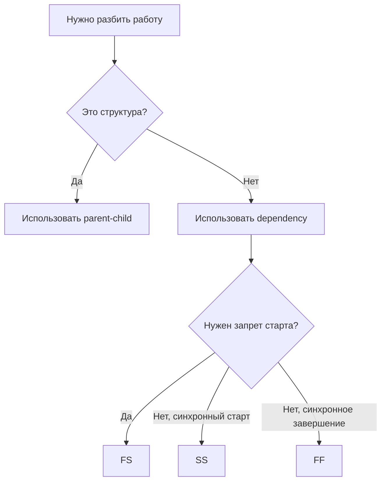

# PlannerBro — Справка пользователя

Документ для конечных пользователей, руководителей и администраторов.

## 1. Быстрый старт

1. Войти в систему.
2. Открыть Дэшборд.
3. Проверить блоки: «Сигналы контроля», «Мои задачи», «Последние обновленные».
4. Открыть нужный проект и перейти в LIST.

## 2. Как работать с проектом

1. Создать проект.
2. Выбрать режим: `Гибкий` или `Строгий`.
3. Настроить сроки, владельца, участников.
4. Добавить задачи и связи между ними.

Важно:
- в строгом режиме система может отклонить некорректные даты и связи;
- при переносе дедлайна требуется причина.

## 3. Как работать с задачами

### Создание

- заполнить название, даты, исполнителей, приоритет;
- при необходимости указать родителя (`Родительская задача`).

### Структура и порядок

- если нужна визуальная декомпозиция: используйте `Родительская задача`;
- если нужен запрет старта до завершения: используйте `Зависит от` (FS/SS/FF).

### Управление состоянием

- статус + прогресс + следующий шаг;
- check-in для регулярного подтверждения движения.

## 4. Кто может назначать кого

Подробная матрица: [15_Права, роли и назначения](./15_Права_роли_и_назначения.md)

Коротко:
- ГИП/ЗАМ, начальники отделов и менеджеры могут назначать кросс-отдельно;
- разработчики работают в рамках своего scope;
- админ может назначать всех.

## 5. Рекомендованный процесс для руководителя

1. Сформировать каркас проекта (этапы верхнего уровня).
2. Добавить подзадачи (parent-child).
3. Проставить зависимости FS/SS/FF.
4. Назначить ответственных (в т.ч. между отделами).
5. Проверять ежедневно:
   - просрочки,
   - задачи без движения,
   - эскалации,
   - задачи без исполнителя.

## 6. Частые вопросы

### Почему не получается назначить пользователя?

- пользователь неактивен;
- не хватает прав назначения по вашей роли/scope;
- проверьте роль, должность и контур доступа в разделе «Команда».

### Почему не сохраняется дедлайн?

- в строгом режиме дата может нарушать правило;
- при переносе дедлайна должна быть причина.

### Почему задача не стартует?

- есть активная FS-зависимость от незавершенной задачи.

## 7. Мини-схема принятия решения

